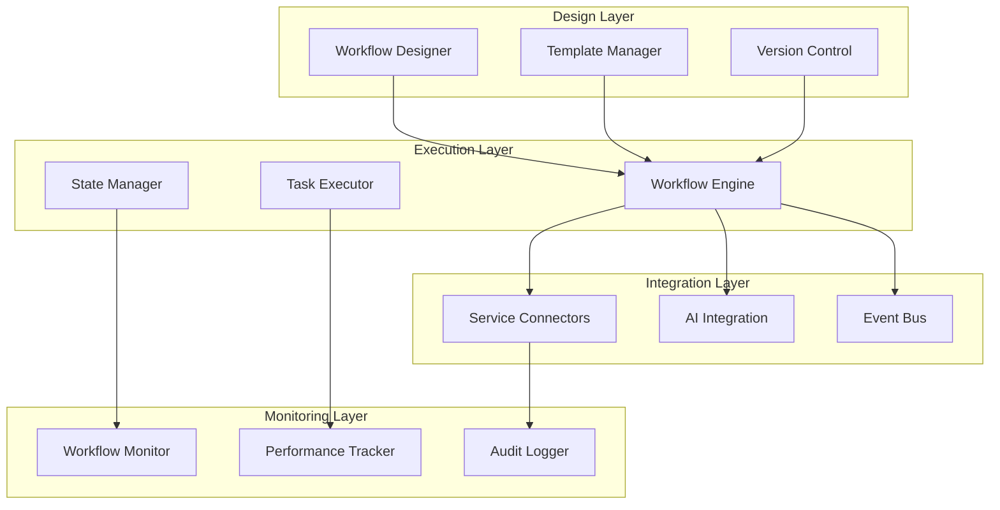
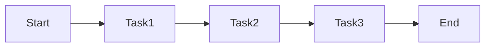
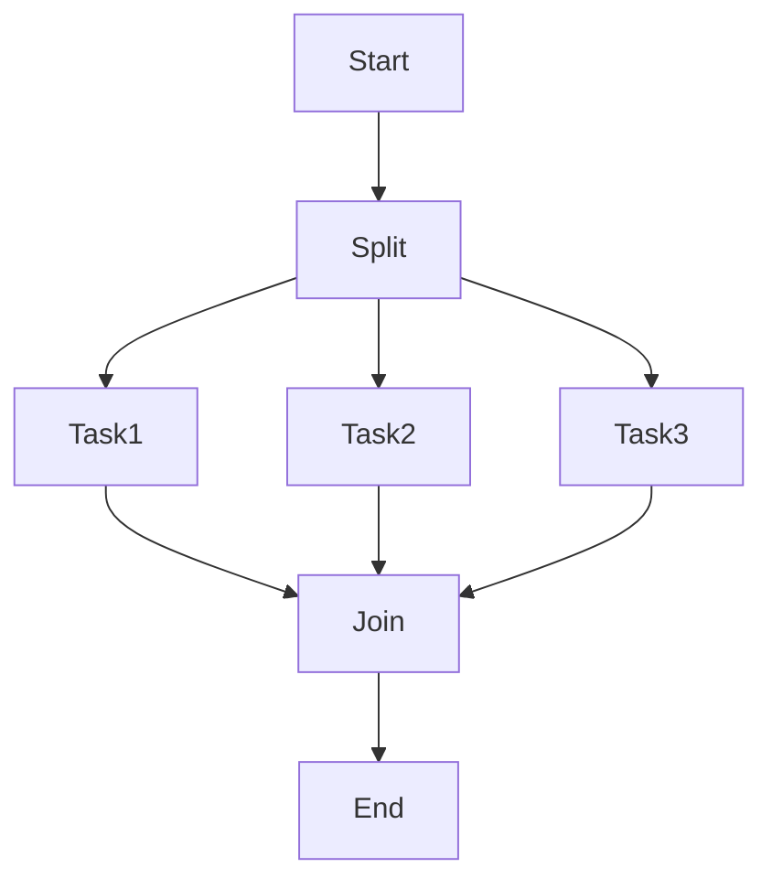
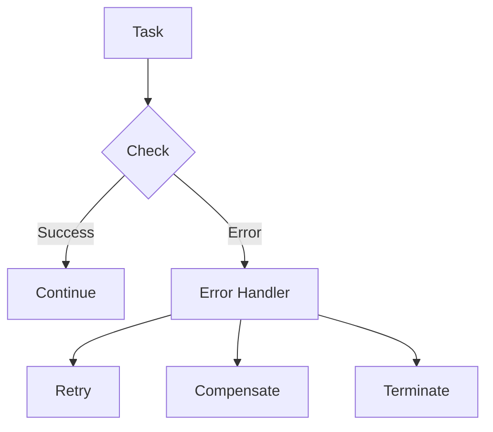

# ⚡ Workflow Automation Engine

## Overview

The Workflow Automation Engine provides a robust platform for designing, executing, and managing automated workflows. It supports complex orchestration patterns, state management, and integration with various services and AI components.

## Architecture

### System Components


## Core Components

### Workflow Definition
```typescript
interface WorkflowDefinition {
  id: string;
  version: string;
  nodes: WorkflowNode[];
  edges: WorkflowEdge[];
  variables: WorkflowVariable[];
  triggers: WorkflowTrigger[];
  error_handlers: ErrorHandler[];
}
```

### State Management
```typescript
interface WorkflowState {
  workflow_id: string;
  instance_id: string;
  status: 'running' | 'paused' | 'completed' | 'failed';
  current_node: string;
  variables: Record<string, any>;
  history: StateTransition[];
}
```

### Task Execution
```typescript
interface TaskConfig {
  type: TaskType;
  inputs: Record<string, any>;
  timeout: number;
  retry_policy: RetryPolicy;
  resource_limits: ResourceLimits;
}
```

## Workflow Patterns

### Sequential Flow


### Parallel Processing


### Error Handling


## Integration Features

### Service Integration
```typescript
interface ServiceConnector {
  service_type: string;
  config: ConnectorConfig;
  methods: {
    connect(): Promise<void>;
    execute(action: string, params: any): Promise<any>;
    disconnect(): Promise<void>;
  };
}
```

### AI Integration
```typescript
interface AITaskConfig {
  model: string;
  prompt_template: string;
  parameters: Record<string, any>;
  output_mapping: OutputSchema;
}
```

### Event Handling
```typescript
interface EventConfig {
  event_type: string;
  filters: EventFilter[];
  correlation_key: string;
  timeout: number;
}
```

## Monitoring & Control

### Workflow Metrics
- Execution time
- Success rate
- Error frequency
- Resource usage
- Cost tracking

### Control Actions
- Pause/Resume
- Cancel
- Retry
- Skip step
- Modify variables

## Performance Optimization

### Caching Strategy
- Result caching
- State caching
- Template caching
- Resource pooling

### Execution Optimization
- Parallel execution
- Resource allocation
- Load balancing
- Queue management

## Security & Compliance

### Access Control
- Role-based access
- Resource isolation
- Data encryption
- Audit logging

### Compliance Features
- Version tracking
- Change history
- Approval flows
- Data lineage

## Related Documentation
- [Template System](TEMPLATE_SYSTEM_DOCUMENTATION.md)
- [Integration Playbooks](integrations/INTEGRATIONS_PLAYBOOKS.md)
- [Security Documentation](SECURITY_DOCUMENTATION.md)
- [Monitoring Documentation](MONITORING_DOCUMENTATION.md)
