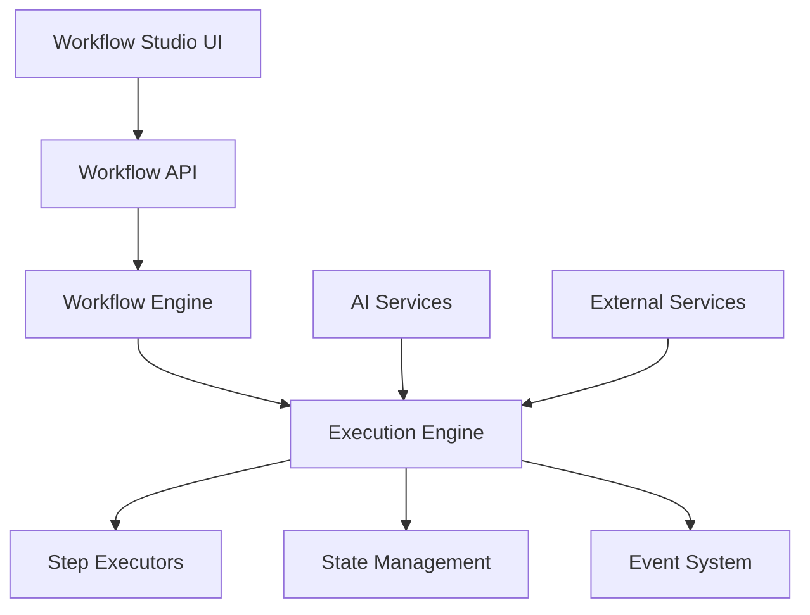

# 🔄 Workflow Engine Documentation

## Overview

This document provides comprehensive documentation for Auterity's Workflow Engine, including its architecture, implementation details, and integration patterns. The Workflow Engine is a core component that enables sophisticated workflow automation with AI-powered decision making.

## Table of Contents

1. [Architecture Overview](#architecture-overview)
2. [Core Components](#core-components)
3. [Workflow Definition](#workflow-definition)
4. [Execution Engine](#execution-engine)
5. [Integration Points](#integration-points)
6. [AI Integration](#ai-integration)
7. [Error Handling](#error-handling)
8. [Performance Optimization](#performance-optimization)

## Architecture Overview

### System Architecture


### Component Locations
```
services/
├── api/src/app/
│   ├── workflow_engine.py
│   ├── workflow_execution_engine.py
│   └── services/
│       ├── step_executors/
│       │   ├── ai_executor.py
│       │   ├── process_executor.py
│       │   └── integration_executor.py
│       └── workflow/
│           ├── state_manager.py
│           ├── event_system.py
│           └── validators.py
```

## Core Components

### Workflow Engine
**Location**: `services/api/src/app/workflow_engine.py`
**Purpose**: Core workflow management and orchestration
**Features**:
- Workflow validation
- State management
- Event handling
- Error recovery

```python
from app.workflow_engine import WorkflowEngine

class WorkflowEngine:
    async def create_workflow(self, definition: dict) -> Workflow:
        """Create a new workflow from definition"""
        validated = await self.validator.validate(definition)
        workflow = await self.factory.create(validated)
        return workflow

    async def execute_workflow(self, workflow_id: str, params: dict) -> Result:
        """Execute a workflow with given parameters"""
        workflow = await self.get_workflow(workflow_id)
        execution = await self.execution_engine.execute(workflow, params)
        return execution.result
```

### Execution Engine
**Location**: `services/api/src/app/workflow_execution_engine.py`
**Purpose**: Workflow execution and step processing
**Features**:
- Step execution
- State tracking
- Error handling
- Retry logic

```python
from app.workflow_execution_engine import WorkflowExecutionEngine

class WorkflowExecutionEngine:
    async def execute(self, workflow: Workflow, params: dict) -> Execution:
        """Execute workflow steps in order"""
        execution = await self.create_execution(workflow, params)
        
        try:
            for step in workflow.steps:
                result = await self.execute_step(step, execution)
                await self.update_state(execution, result)
        except WorkflowError as e:
            await self.handle_error(execution, e)
        
        return execution
```

## Workflow Definition

### Basic Structure
```yaml
# Example workflow definition
name: "Document Processing"
version: "1.0"
description: "Process and analyze documents with AI"

steps:
  - id: "document_input"
    type: "input"
    config:
      required_fields:
        - "document_url"
        - "document_type"

  - id: "ai_analysis"
    type: "ai_processing"
    config:
      model: "gpt-4"
      max_tokens: 1000
      temperature: 0.7

  - id: "result_storage"
    type: "storage"
    config:
      storage_type: "s3"
      bucket: "processed-documents"
```

### Validation Rules
```python
# services/api/src/app/workflow/validators.py
from app.workflow.validators import WorkflowValidator

class WorkflowValidator:
    async def validate(self, definition: dict) -> dict:
        """Validate workflow definition"""
        await self.validate_structure(definition)
        await self.validate_steps(definition['steps'])
        await self.validate_connections(definition)
        return definition

    async def validate_steps(self, steps: list) -> None:
        """Validate individual steps"""
        for step in steps:
            validator = self.get_step_validator(step['type'])
            await validator.validate(step)
```

## Execution Engine

### Step Execution
```python
# services/api/src/app/services/step_executors/base_executor.py
from app.services.step_executors import BaseStepExecutor

class BaseStepExecutor:
    async def execute(self, step: Step, context: Context) -> Result:
        """Execute a workflow step"""
        try:
            await self.validate_inputs(step, context)
            result = await self._execute(step, context)
            await self.validate_output(result)
            return result
        except StepError as e:
            await self.handle_error(step, e)
```

### State Management
```python
# services/api/src/app/services/workflow/state_manager.py
from app.services.workflow.state_manager import StateManager

class StateManager:
    async def update_state(self, execution_id: str, state: dict) -> None:
        """Update workflow execution state"""
        async with self.lock(execution_id):
            current = await self.get_state(execution_id)
            merged = self.merge_states(current, state)
            await self.save_state(execution_id, merged)
```

## Integration Points

### External Service Integration
```python
# services/api/src/app/services/step_executors/integration_executor.py
from app.services.step_executors import IntegrationExecutor

class IntegrationExecutor(BaseStepExecutor):
    async def _execute(self, step: Step, context: Context) -> Result:
        """Execute integration step"""
        service = await self.get_service(step.config['service'])
        
        params = await self.prepare_params(step, context)
        result = await service.execute(params)
        
        return await self.process_result(result)
```

### Event System
```python
# services/api/src/app/services/workflow/event_system.py
from app.services.workflow.event_system import EventSystem

class EventSystem:
    async def emit(self, event_type: str, data: dict) -> None:
        """Emit workflow event"""
        event = await self.create_event(event_type, data)
        await self.publish(event)
        await self.process_subscribers(event)
```

## AI Integration

### AI Step Executor
```python
# services/api/src/app/services/step_executors/ai_executor.py
from app.services.step_executors import AIExecutor

class AIExecutor(BaseStepExecutor):
    async def _execute(self, step: Step, context: Context) -> Result:
        """Execute AI processing step"""
        model = await self.get_model(step.config['model'])
        
        prompt = await self.build_prompt(step, context)
        response = await model.generate(prompt)
        
        return await self.process_response(response)
```

### Model Selection
```python
# services/api/src/app/services/ai/model_selector.py
from app.services.ai import ModelSelector

class ModelSelector:
    async def select_model(self, requirements: dict) -> Model:
        """Select appropriate AI model"""
        available = await self.get_available_models()
        filtered = self.filter_models(available, requirements)
        return await self.rank_models(filtered)
```

## Error Handling

### Error Recovery
```python
# services/api/src/app/workflow/error_recovery.py
from app.workflow.error_recovery import ErrorRecovery

class ErrorRecovery:
    async def handle_error(self, execution: Execution, error: Error) -> None:
        """Handle workflow execution error"""
        strategy = await self.get_recovery_strategy(error)
        if strategy:
            await strategy.execute(execution)
        else:
            await self.fail_execution(execution, error)
```

### Retry Logic
```python
# services/api/src/app/workflow/retry.py
from app.workflow.retry import RetryHandler

class RetryHandler:
    async def retry_step(self, step: Step, context: Context) -> Result:
        """Retry failed step with backoff"""
        for attempt in range(step.max_retries):
            try:
                return await self.execute_step(step, context)
            except RetryableError as e:
                await self.wait_backoff(attempt)
```

## Performance Optimization

### Caching
```python
# services/api/src/app/workflow/cache.py
from app.workflow.cache import WorkflowCache

class WorkflowCache:
    async def get_or_compute(
        self,
        key: str,
        computer: Callable,
        ttl: int = 3600
    ) -> Any:
        """Get cached result or compute"""
        cached = await self.get(key)
        if cached:
            return cached
            
        result = await computer()
        await self.set(key, result, ttl)
        return result
```

### Parallel Execution
```python
# services/api/src/app/workflow/parallel.py
from app.workflow.parallel import ParallelExecutor

class ParallelExecutor:
    async def execute_parallel(
        self,
        steps: List[Step],
        context: Context
    ) -> List[Result]:
        """Execute steps in parallel"""
        tasks = [
            self.execute_step(step, context)
            for step in steps
        ]
        return await asyncio.gather(*tasks)
```

## Development Guidelines

### Creating Custom Steps
```python
# Example custom step implementation
from app.workflow.steps import BaseStep

class CustomStep(BaseStep):
    async def validate(self) -> None:
        """Validate step configuration"""
        required = ['input_field', 'output_field']
        for field in required:
            if field not in self.config:
                raise ValidationError(f"Missing {field}")

    async def execute(self, context: Context) -> Result:
        """Execute custom step logic"""
        input_data = context.get(self.config['input_field'])
        result = await self.process_data(input_data)
        return Result(self.config['output_field'], result)
```

### Testing Strategy
```python
# Example workflow test
from app.tests.workflow import WorkflowTestCase

class TestCustomWorkflow(WorkflowTestCase):
    async def test_workflow_execution(self):
        """Test end-to-end workflow execution"""
        definition = self.load_test_definition()
        workflow = await self.engine.create_workflow(definition)
        
        result = await self.engine.execute_workflow(
            workflow.id,
            self.test_params
        )
        
        self.validate_result(result)
```

This documentation provides a comprehensive overview of Auterity's Workflow Engine. For specific implementation details or advanced usage patterns, refer to the individual component documentation or contact the development team.
