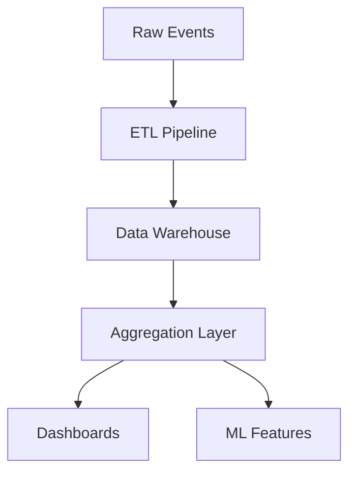

# 📈 Data & Analytics Governanc

e

#

# Metric Taxonom

y

#

## Core Metrics

- **User Engagement

* *

  - DAU/MAU (daily/monthly active users

)

  - Session duration, bounce rat

e

  - Feature adoption rat

e

- **Workflow Performance

* *

  - Success rate, error rat

e

  - Average completion tim

e

  - Resource utilizatio

n

- **Business KPIs

* *

  - Customer acquisition cos

t

  - Revenue per use

r

  - Churn rat

e

#

## Naming Conventions

- Prefix: category_subcategor

y

- Suffix: _count, _rate, _pc

t

- Time units: _daily, _mtd, _yt

d

#

## Ownership Matrix

| Metric Category | Owner | Reviewers | SLA |
|----------------|-------|----------|-----|

| User Analytics | Product | Data Science | 24h |
| System Health | SRE | Platform | 5m |
| Business | Finance | Product | 1h |

#

# Dashboard Qualit

y

#

## Freshness SLAs

- Real-time metrics: < 1 minut

e

- Hourly aggregates: < 15 minute

s

- Daily reports: < 4 hour

s

#

## Validation Process

1. Data completeness chec

k

2. Cross-source reconciliati

o

n

3. Historical trend compariso

n

4. Anomaly detectio

n

5. Business logic validatio

n

#

## Accuracy Requirements

- Financial metrics: 100% accurat

e

- Analytics: 98% confidenc

e

- Real-time: Best effort, corrected within 24

h

#

# Data Lineag

e

#

## Source Systems

- Production database

s

- Event stream

s

- External API

s

- User analytic

s

#

## Transformations

#

## Change Management

1. Impact analysis templat

e

2. Stakeholder notificatio

n

3. Backward compatibility perio

d

4. Migration validatio

n

5. Rollback pla

n

#

## Monitoring

- Pipeline SLA

s

- Data quality metric

s

- Schema drift alert

s

- Usage analytic

s

