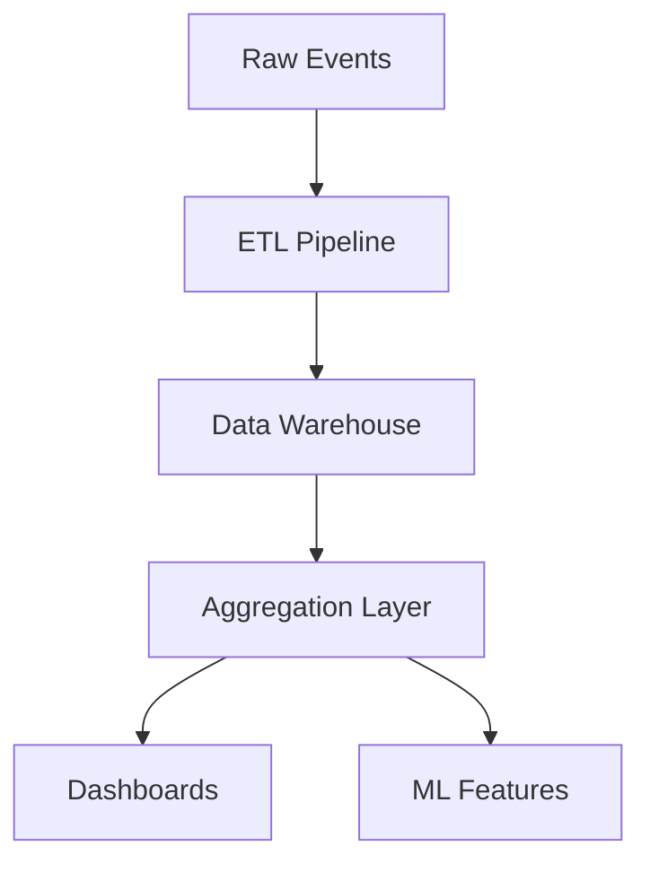

# 📈 Data & Analytics Governance

## Metric Taxonomy

### Core Metrics
- **User Engagement**
  - DAU/MAU (daily/monthly active users)
  - Session duration, bounce rate
  - Feature adoption rate
- **Workflow Performance**
  - Success rate, error rate
  - Average completion time
  - Resource utilization
- **Business KPIs**
  - Customer acquisition cost
  - Revenue per user
  - Churn rate

### Naming Conventions
- Prefix: category_subcategory
- Suffix: _count, _rate, _pct
- Time units: _daily, _mtd, _ytd

### Ownership Matrix
| Metric Category | Owner | Reviewers | SLA |
|----------------|-------|----------|-----|
| User Analytics | Product | Data Science | 24h |
| System Health | SRE | Platform | 5m |
| Business | Finance | Product | 1h |

## Dashboard Quality

### Freshness SLAs
- Real-time metrics: < 1 minute
- Hourly aggregates: < 15 minutes
- Daily reports: < 4 hours

### Validation Process
1. Data completeness check
2. Cross-source reconciliation
3. Historical trend comparison
4. Anomaly detection
5. Business logic validation

### Accuracy Requirements
- Financial metrics: 100% accurate
- Analytics: 98% confidence
- Real-time: Best effort, corrected within 24h

## Data Lineage

### Source Systems
- Production databases
- Event streams
- External APIs
- User analytics

### Transformations

### Change Management
1. Impact analysis template
2. Stakeholder notification
3. Backward compatibility period
4. Migration validation
5. Rollback plan

### Monitoring
- Pipeline SLAs
- Data quality metrics
- Schema drift alerts
- Usage analytics

