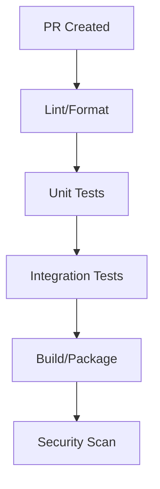

# 🧰 DevEx & Release Guid

e

#

# Developer Onboardin

g

#

## 90-Minute Setu

p

1. Clone repo & install dependencies


```bash
   git clone ...
   npm install


```

2. Configure env vars (copy .env.example

)

3. Start services with docker-compo

s

e

4. Run migrations & seed dat

a

#

## First PR Checklist

- [ ] Local dev environment runnin

g

- [ ] Linting/formatting configure

d

- [ ] Tests passing locall

y

- [ ] PR template reviewe

d

- [ ] Branch naming convention followe

d

#

## Local Environment Tips

- Use `npm run dev` for hot reloa

d

- Debug configuration in .vscode

/

- Common issues & solution

s

- Performance optimization flag

s

#

# CI/CD Pipelin

e

#

## Build Pipeline



#

## Quality Gates

- Code coverage >= 80

%

- No high/critical security finding

s

- Performance regression check

s

- API contract validatio

n

#

## Environments

- Development (auto-deploy

)

- Staging (manual approval

)

- Production (change window

)

#

# Release Managemen

t

#

## Semantic Versioning

- Major: Breaking change

s

- Minor: New feature

s

- Patch: Bug fixe

s

#

## Changelog Process

1. PR description templat

e

2. Auto-generated from commi

t

s

3. Release notes revie

w

4. Customer-facing updat

e

s

#

## Deployment Strategy

- Blue/green deploymen

t

- Feature flags for risky change

s

- Automated smoke test

s

- Rollback procedure

s

#

## Monitoring

- Deploy-time metric

s

- Error rate trackin

g

- Performance impac

t

- User-facing issue

s

