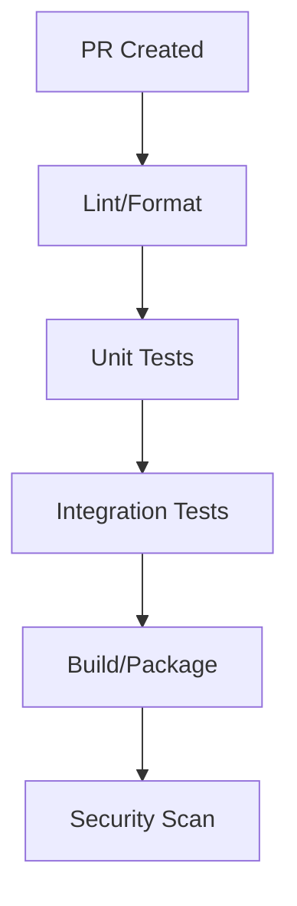

# 🧰 DevEx & Release Guide

## Developer Onboarding

### 90-Minute Setup
1. Clone repo & install dependencies
   ```bash
   git clone ...
   npm install
   ```
2. Configure env vars (copy .env.example)
3. Start services with docker-compose
4. Run migrations & seed data

### First PR Checklist
- [ ] Local dev environment running
- [ ] Linting/formatting configured
- [ ] Tests passing locally
- [ ] PR template reviewed
- [ ] Branch naming convention followed

### Local Environment Tips
- Use `npm run dev` for hot reload
- Debug configuration in .vscode/
- Common issues & solutions
- Performance optimization flags

## CI/CD Pipeline

### Build Pipeline


### Quality Gates
- Code coverage >= 80%
- No high/critical security findings
- Performance regression checks
- API contract validation

### Environments
- Development (auto-deploy)
- Staging (manual approval)
- Production (change window)

## Release Management

### Semantic Versioning
- Major: Breaking changes
- Minor: New features
- Patch: Bug fixes

### Changelog Process
1. PR description template
2. Auto-generated from commits
3. Release notes review
4. Customer-facing updates

### Deployment Strategy
- Blue/green deployment
- Feature flags for risky changes
- Automated smoke tests
- Rollback procedures

### Monitoring
- Deploy-time metrics
- Error rate tracking
- Performance impact
- User-facing issues

