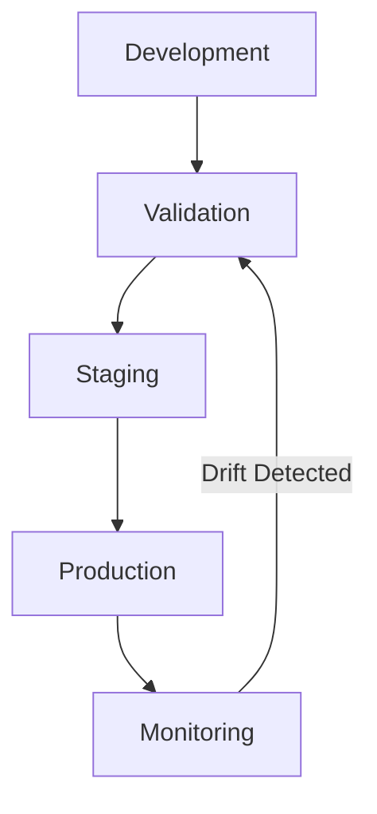

# 🧪 ML Governance Handbook

## Model Lifecycle Management

### Model Registry
- Model metadata (architecture, training data, params)
- Version control & artifacts
- Dependencies & environment
- Performance metrics history

### Approval Process
1. Model validation report
2. Bias assessment
3. Performance review
4. Security scan
5. Stakeholder sign-off

### Version Control


## Evaluation Framework

### Golden Datasets
- Validation set composition
- Edge cases coverage
- Protected attributes
- Adversarial examples

### Performance Metrics
| Metric | Target | Alert Threshold |
|--------|--------|----------------|
| Accuracy | >95% | <90% |
| Latency p95 | <100ms | >200ms |
| Error Rate | <1% | >2% |
| Bias Score | <0.1 | >0.2 |

### Monitoring
- Model drift detection
- Feature distribution shifts
- Performance degradation
- Resource utilization

## Prompt Engineering & Safety

### Prompt Standards
```yaml
system_prompt:
  role: Clear scope/boundaries
  constraints: Explicit limitations
  examples: Representative cases
  fallbacks: Graceful handling
```

### Safety Measures
1. Input validation
2. Output sanitization
3. Toxicity detection
4. PII protection
5. Jailbreak prevention

### Testing Protocol
- Adversarial prompts
- Edge case handling
- Safety boundary tests
- Performance impact

## Feedback & Quality Control

### Human Review Process
1. Sample selection strategy
2. Review criteria & rubric
3. Reviewer qualification
4. Feedback incorporation
5. Quality metrics

### Online Evaluation
- A/B testing framework
- Real-time monitoring
- User feedback collection
- Performance tracking

### Offline Evaluation
- Benchmark suites
- Regression testing
- Comparative analysis
- Cost-benefit metrics

### Data Quality
- Labeling standards
- Validation workflows
- Quality metrics
- Improvement feedback loop


