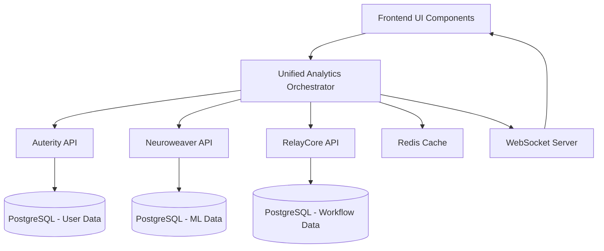

# 🔧 Auterity Analytics Integration Specifications

## Overview

This document outlines the comprehensive integration specifications for the enhanced Auterity Analytics System, combining Business Intelligence with AI/ML Analytics across the multi-system architecture (Auterity + Neuroweaver + RelayCore).

## Architecture Overview

### System Components

```
┌─────────────────────────────────────────────────────────────┐
│                    Unified Analytics Platform                │
├─────────────────────────────────────────────────────────────┤
│  ┌─────────────┐  ┌─────────────┐  ┌─────────────┐         │
│  │  Analytics  │  │   ModelHub  │  │  Cognitive │         │
│  │ Dashboard   │  │             │  │ Dashboard  │         │
│  │ (Business)  │  │  (AI/ML)    │  │ (Workflow) │         │
│  └─────────────┘  └─────────────┘  └─────────────┘         │
├─────────────────────────────────────────────────────────────┤
│           Unified Analytics Orchestrator                    │
├─────────────────────────────────────────────────────────────┤
│  ┌─────────────┐  ┌─────────────┐  ┌─────────────┐         │
│  │   Auterity  │  │ Neuroweaver │  │ RelayCore  │         │
│  │   (Users)   │  │   (AI/ML)   │  │ (Workflow) │         │
│  └─────────────┘  └─────────────┘  └─────────────┘         │
└─────────────────────────────────────────────────────────────┘
```

## 1. Core Integration Points

### 1.1 Data Flow Architecture



### 1.2 API Integration Layer

#### Analytics API (`/api/analytics`)
```typescript
interface AnalyticsAPI {
  // User Analytics
  getUserAnalytics(filters?: AnalyticsFilters): Promise<UserAnalytics>
  getSystemPerformance(dateRange?: DateRange): Promise<SystemPerformance[]>
  getBusinessMetrics(tenantId: string, dateRange?: DateRange): Promise<BusinessMetrics>

  // Event Tracking
  trackEvent(event: TrackingEvent): Promise<{ eventId: string }>
  trackPerformanceMetric(metric: PerformanceMetric): Promise<{ metricId: string }>

  // Real-time
  subscribeToUpdates(callback: (update: any) => void): () => void
}
```

#### ModelHub API (`/api/modelhub`)
```typescript
interface ModelHubAPI {
  // ML Analytics
  getMLAnalytics(dateRange?: DateRange): Promise<MLAnalytics>
  getModelPerformance(modelId?: string): Promise<ModelPerformance[]>
  getPromptAnalytics(filters?: PromptFilters): Promise<PromptAnalytics>

  // Tracking & Feedback
  trackPromptOutput(promptData: PromptOutputData): Promise<{ id: string }>
  submitFeedback(feedbackData: FeedbackData): Promise<{ feedbackId: string }>

  // Optimization
  getOptimizationSuggestions(modelId?: string): Promise<OptimizationSuggestion[]>
  startModelTuning(config: TuningConfig): Promise<{ sessionId: string }>

  // Real-time
  subscribeToMLUpdates(callback: (update: any) => void): () => void
}
```

#### Unified API Orchestrator (`/api/unified`)
```typescript
interface UnifiedAPI {
  // Cross-system analytics
  getUnifiedAnalytics(tenantId: string, dateRange?: DateRange): Promise<UnifiedAnalytics>

  // Correlation analysis
  calculateCorrelations(data: UnifiedAnalytics): Promise<SystemCorrelation[]>
  generateInsights(data: UnifiedAnalytics): Promise<UnifiedInsight[]>

  // Health monitoring
  getSystemHealth(): Promise<SystemHealth>

  // Real-time orchestration
  subscribeToUnifiedUpdates(callback: (update: CrossSystemEvent) => void): () => void
}
```

## 2. Component Integration Specifications

### 2.1 Unified Analytics Dashboard

#### Purpose
Main orchestrator component that combines all analytics views with cross-system correlations.

#### Features
- **Multi-tab Interface**: Overview, Business, AI/ML, Insights
- **Real-time Updates**: WebSocket integration for live data
- **Cross-system Correlations**: Statistical analysis across systems
- **Adaptive Layout**: Responsive design for all screen sizes
- **Export Capabilities**: PDF, CSV, JSON export options

#### Integration Points
```typescript
interface UnifiedAnalyticsDashboardProps {
  tenantId?: string;
  config?: DashboardConfig;
  onInsightAction?: (insightId: string, action: string) => void;
  onAlertAction?: (alertId: string, action: string) => void;
}
```

#### Data Dependencies
- User analytics from Auterity
- ML performance from Neuroweaver
- Workflow metrics from RelayCore
- System health across all systems
- Real-time event streams

### 2.2 Business Analytics Panel

#### Purpose
Dedicated business intelligence component with user behavior and system performance analytics.

#### Key Metrics
- User acquisition and retention
- Session duration and engagement
- Conversion funnels
- Device and geographic breakdowns
- Revenue and business KPIs

#### Integration Points
```typescript
interface BusinessAnalyticsPanelProps {
  data: {
    userAnalytics: UserAnalytics;
    systemPerformance: SystemPerformance;
    businessMetrics: BusinessMetrics;
  };
  enableRealtime?: boolean;
  expanded?: boolean;
}
```

### 2.3 ML Analytics Panel

#### Purpose
AI/ML performance analytics with model comparison, prompt optimization, and cost analysis.

#### Key Features
- Model performance comparison
- Prompt quality analysis
- Cost optimization recommendations
- Real-time model health monitoring
- Experiment tracking and A/B testing

#### Integration Points
```typescript
interface MLAnalyticsPanelProps {
  data: MLAnalytics;
  enableRealtime?: boolean;
  expanded?: boolean;
}
```

### 2.4 Cross-System Insights

#### Purpose
AI-powered insights and correlations across all integrated systems.

#### Features
- Statistical correlation analysis
- Predictive insights and recommendations
- Alert management and notifications
- Impact assessment and prioritization
- Automated action suggestions

#### Integration Points
```typescript
interface CrossSystemInsightsProps {
  correlations: SystemCorrelation[];
  insights: UnifiedInsight[];
  health: SystemHealth;
  onInsightAction?: (insightId: string, action: string) => void;
  onAlertAction?: (alertId: string, action: string) => void;
}
```

## 3. Real-time Integration

### 3.1 WebSocket Architecture

#### Connection Management
```typescript
class RealtimeManager {
  private ws: WebSocket | null = null;
  private reconnectAttempts = 0;
  private maxReconnectAttempts = 5;
  private reconnectDelay = 1000;

  connect(): Promise<void> {
    // Implementation for WebSocket connection
  }

  subscribe(channel: string, callback: (data: any) => void): () => void {
    // Implementation for channel subscription
  }

  disconnect(): void {
    // Implementation for clean disconnect
  }
}
```

#### Event Types
```typescript
type RealtimeEvent =
  | { type: 'metric_update'; data: any; source: string }
  | { type: 'alert'; data: AlertData; severity: 'low' | 'medium' | 'high' | 'critical' }
  | { type: 'insight'; data: InsightData; confidence: number }
  | { type: 'correlation_update'; data: CorrelationData; timestamp: Date }
  | { type: 'health_change'; data: HealthData; system: string };
```

### 3.2 Polling Fallback

For environments where WebSocket is not available, implement HTTP polling:

```typescript
class PollingFallback {
  private intervalId: NodeJS.Timeout | null = null;
  private pollInterval = 30000; // 30 seconds

  start(callback: (data: any) => void): void {
    this.intervalId = setInterval(async () => {
      try {
        const data = await this.fetchLatestData();
        callback(data);
      } catch (error) {
        console.error('Polling failed:', error);
      }
    }, this.pollInterval);
  }

  stop(): void {
    if (this.intervalId) {
      clearInterval(this.intervalId);
      this.intervalId = null;
    }
  }

  private async fetchLatestData(): Promise<any> {
    // Implementation for HTTP polling
  }
}
```

## 4. Database Schema Integration

### 4.1 Unified Data Model

#### Core Tables
```sql
-- User Analytics
CREATE TABLE user_sessions (
  id UUID PRIMARY KEY,
  user_id UUID,
  session_id VARCHAR(255),
  start_time TIMESTAMP,
  end_time TIMESTAMP,
  duration INTEGER,
  page_views INTEGER,
  events JSONB,
  device_info JSONB,
  location_info JSONB,
  created_at TIMESTAMP DEFAULT NOW()
);

-- AI/ML Analytics
CREATE TABLE prompt_outputs (
  id UUID PRIMARY KEY,
  prompt_hash VARCHAR(64),
  prompt TEXT,
  output TEXT,
  model_id VARCHAR(100),
  model_version VARCHAR(50),
  tokens_used INTEGER,
  response_time_ms INTEGER,
  user_rating DECIMAL(3,2),
  user_feedback TEXT,
  created_at TIMESTAMP DEFAULT NOW()
);

-- System Correlations
CREATE TABLE system_correlations (
  id UUID PRIMARY KEY,
  correlation_type VARCHAR(50),
  systems JSONB,
  correlation_value DECIMAL(5,4),
  confidence DECIMAL(5,4),
  business_value DECIMAL(10,2),
  metadata JSONB,
  calculated_at TIMESTAMP DEFAULT NOW()
);

-- Unified Insights
CREATE TABLE unified_insights (
  id UUID PRIMARY KEY,
  insight_type VARCHAR(50),
  title VARCHAR(255),
  description TEXT,
  severity VARCHAR(20),
  affected_systems JSONB,
  metrics JSONB,
  recommendations JSONB,
  status VARCHAR(20) DEFAULT 'active',
  created_at TIMESTAMP DEFAULT NOW()
);
```

### 4.2 Indexing Strategy

```sql
-- Performance indexes for analytics queries
CREATE INDEX idx_user_sessions_user_id ON user_sessions(user_id);
CREATE INDEX idx_user_sessions_created_at ON user_sessions(created_at);
CREATE INDEX idx_prompt_outputs_model_id ON prompt_outputs(model_id);
CREATE INDEX idx_prompt_outputs_created_at ON prompt_outputs(created_at);
CREATE INDEX idx_system_correlations_type ON system_correlations(correlation_type);
CREATE INDEX idx_unified_insights_type ON unified_insights(insight_type);
CREATE INDEX idx_unified_insights_status ON unified_insights(status);

-- Composite indexes for complex queries
CREATE INDEX idx_user_sessions_time_range ON user_sessions(start_time, end_time);
CREATE INDEX idx_prompt_outputs_performance ON prompt_outputs(model_id, response_time_ms, user_rating);
```

### 4.3 Data Aggregation Views

```sql
-- Daily user analytics aggregation
CREATE MATERIALIZED VIEW daily_user_analytics AS
SELECT
  DATE(created_at) as date,
  COUNT(DISTINCT user_id) as unique_users,
  COUNT(*) as total_sessions,
  AVG(duration) as avg_session_duration,
  SUM(page_views) as total_page_views,
  AVG(events::text::jsonb->>'conversion_rate')::decimal as avg_conversion_rate
FROM user_sessions
GROUP BY DATE(created_at);

-- Hourly AI performance aggregation
CREATE MATERIALIZED VIEW hourly_ai_performance AS
SELECT
  DATE_TRUNC('hour', created_at) as hour,
  model_id,
  COUNT(*) as request_count,
  AVG(response_time_ms) as avg_response_time,
  AVG(user_rating) as avg_rating,
  SUM(tokens_used) as total_tokens,
  COUNT(*) FILTER (WHERE user_rating >= 4) as high_rated_requests
FROM prompt_outputs
GROUP BY DATE_TRUNC('hour', created_at), model_id;
```

## 5. Caching Strategy

### 5.1 Multi-level Caching

```typescript
interface CacheConfig {
  redis: {
    host: string;
    port: number;
    password?: string;
    db: number;
  };
  ttl: {
    userAnalytics: number;     // 5 minutes
    systemMetrics: number;     // 1 minute
    mlPerformance: number;     // 10 minutes
    correlations: number;      // 30 minutes
    insights: number;          // 15 minutes
  };
}

class CacheManager {
  private redis: Redis;
  private memoryCache = new Map<string, { data: any; expiry: number }>();

  async get<T>(key: string): Promise<T | null> {
    // Check memory cache first
    const memoryData = this.memoryCache.get(key);
    if (memoryData && Date.now() < memoryData.expiry) {
      return memoryData.data;
    }

    // Check Redis cache
    const redisData = await this.redis.get(key);
    if (redisData) {
      const parsed = JSON.parse(redisData);
      // Update memory cache
      this.memoryCache.set(key, { data: parsed, expiry: Date.now() + 300000 }); // 5 minutes
      return parsed;
    }

    return null;
  }

  async set(key: string, data: any, ttlSeconds: number): Promise<void> {
    const serialized = JSON.stringify(data);

    // Set in Redis with TTL
    await this.redis.setex(key, ttlSeconds, serialized);

    // Set in memory cache
    this.memoryCache.set(key, {
      data,
      expiry: Date.now() + (ttlSeconds * 1000)
    });
  }

  async invalidate(pattern: string): Promise<void> {
    // Invalidate Redis keys matching pattern
    const keys = await this.redis.keys(pattern);
    if (keys.length > 0) {
      await this.redis.del(...keys);
    }

    // Invalidate memory cache
    for (const [key] of this.memoryCache) {
      if (key.includes(pattern.replace('*', ''))) {
        this.memoryCache.delete(key);
      }
    }
  }
}
```

### 5.2 Cache Keys Strategy

```typescript
class CacheKeys {
  static userAnalytics(tenantId: string, dateRange?: DateRange): string {
    const range = dateRange ? `${dateRange.from.toISOString()}_${dateRange.to.toISOString()}` : 'all';
    return `analytics:user:${tenantId}:${range}`;
  }

  static mlAnalytics(modelId?: string, dateRange?: DateRange): string {
    const model = modelId || 'all';
    const range = dateRange ? `${dateRange.from.toISOString()}_${dateRange.to.toISOString()}` : 'all';
    return `analytics:ml:${model}:${range}`;
  }

  static correlations(tenantId: string): string {
    return `analytics:correlations:${tenantId}`;
  }

  static insights(tenantId: string, type?: string): string {
    const insightType = type || 'all';
    return `analytics:insights:${tenantId}:${insightType}`;
  }

  static systemHealth(): string {
    return 'analytics:health:system';
  }
}
```

## 6. Security & Access Control

### 6.1 Authentication & Authorization

```typescript
interface SecurityContext {
  userId: string;
  tenantId: string;
  roles: string[];
  permissions: string[];
  apiKey?: string;
  sessionId: string;
}

class AnalyticsSecurity {
  private jwtSecret: string;
  private apiKeyHeader = 'X-API-Key';

  async authenticate(request: Request): Promise<SecurityContext> {
    // JWT token validation
    const token = this.extractToken(request);
    if (token) {
      return this.validateJWT(token);
    }

    // API key validation
    const apiKey = request.headers.get(this.apiKeyHeader);
    if (apiKey) {
      return this.validateAPIKey(apiKey);
    }

    throw new Error('No valid authentication provided');
  }

  async authorize(context: SecurityContext, resource: string, action: string): Promise<boolean> {
    // Check role-based permissions
    if (context.roles.includes('admin')) {
      return true;
    }

    // Check specific permissions
    const requiredPermission = `${resource}:${action}`;
    return context.permissions.includes(requiredPermission);
  }

  private extractToken(request: Request): string | null {
    const authHeader = request.headers.get('Authorization');
    if (authHeader?.startsWith('Bearer ')) {
      return authHeader.substring(7);
    }
    return null;
  }

  private async validateJWT(token: string): Promise<SecurityContext> {
    // JWT validation implementation
    // Return security context
  }

  private async validateAPIKey(apiKey: string): Promise<SecurityContext> {
    // API key validation implementation
    // Return security context
  }
}
```

### 6.2 Data Privacy & Compliance

```typescript
interface PrivacyConfig {
  dataRetention: {
    userAnalytics: number;     // days
    systemLogs: number;        // days
    aiPrompts: number;         // days
    performanceMetrics: number; // days
  };
  anonymization: {
    enabled: boolean;
    fields: string[];
    methods: {
      hash: string[];
      mask: string[];
      remove: string[];
    };
  };
  consent: {
    required: boolean;
    categories: string[];
    tracking: boolean;
  };
}

class DataPrivacyManager {
  private config: PrivacyConfig;

  async processDataForStorage(data: any, category: string): Promise<any> {
    // Apply privacy transformations based on category
    switch (category) {
      case 'user_analytics':
        return this.anonymizeUserData(data);
      case 'ai_prompts':
        return this.sanitizePromptData(data);
      case 'system_logs':
        return this.maskSystemData(data);
      default:
        return data;
    }
  }

  private anonymizeUserData(data: any): any {
    // Implement user data anonymization
    // Hash sensitive identifiers, mask PII, etc.
  }

  private sanitizePromptData(data: any): any {
    // Remove or mask sensitive content in prompts
  }

  private maskSystemData(data: any): any {
    // Mask sensitive system information
  }

  async scheduleDataCleanup(): Promise<void> {
    // Implement automated data cleanup based on retention policies
    for (const [category, retentionDays] of Object.entries(this.config.dataRetention)) {
      await this.cleanupOldData(category, retentionDays);
    }
  }

  private async cleanupOldData(category: string, retentionDays: number): Promise<void> {
    // Database cleanup implementation
  }
}
```

## 7. Monitoring & Observability

### 7.1 Metrics Collection

```typescript
interface SystemMetrics {
  timestamp: Date;
  service: string;
  endpoint: string;
  method: string;
  responseTime: number;
  statusCode: number;
  userAgent?: string;
  ipAddress?: string;
  userId?: string;
  tenantId?: string;
  errorMessage?: string;
}

class MetricsCollector {
  private metrics: SystemMetrics[] = [];
  private batchSize = 100;
  private flushInterval = 60000; // 1 minute

  recordMetric(metric: SystemMetrics): void {
    this.metrics.push(metric);

    if (this.metrics.length >= this.batchSize) {
      this.flush();
    }
  }

  private async flush(): Promise<void> {
    if (this.metrics.length === 0) return;

    try {
      // Send metrics to monitoring service
      await this.sendToMonitoring(this.metrics);
      this.metrics = [];
    } catch (error) {
      console.error('Failed to flush metrics:', error);
      // Retry logic or local storage fallback
    }
  }

  private async sendToMonitoring(metrics: SystemMetrics[]): Promise<void> {
    // Implementation for sending to monitoring service (e.g., Prometheus, DataDog)
  }

  startPeriodicFlush(): void {
    setInterval(() => this.flush(), this.flushInterval);
  }
}
```

### 7.2 Alert Management

```typescript
interface AlertRule {
  id: string;
  name: string;
  condition: {
    metric: string;
    operator: 'gt' | 'lt' | 'eq' | 'ne';
    threshold: number;
    duration: number; // seconds
  };
  severity: 'low' | 'medium' | 'high' | 'critical';
  channels: ('email' | 'slack' | 'webhook' | 'dashboard')[];
  enabled: boolean;
  cooldown: number; // seconds
}

class AlertManager {
  private rules: AlertRule[] = [];
  private activeAlerts = new Map<string, { timestamp: Date; count: number }>();

  async checkAlerts(metrics: any): Promise<void> {
    for (const rule of this.rules) {
      if (!rule.enabled) continue;

      const isTriggered = this.evaluateCondition(rule.condition, metrics);

      if (isTriggered) {
        await this.triggerAlert(rule);
      } else {
        // Reset cooldown if condition is no longer met
        this.activeAlerts.delete(rule.id);
      }
    }
  }

  private evaluateCondition(condition: AlertRule['condition'], metrics: any): boolean {
    const value = this.getNestedValue(metrics, condition.metric);
    if (value === undefined) return false;

    switch (condition.operator) {
      case 'gt': return value > condition.threshold;
      case 'lt': return value < condition.threshold;
      case 'eq': return value === condition.threshold;
      case 'ne': return value !== condition.threshold;
      default: return false;
    }
  }

  private async triggerAlert(rule: AlertRule): Promise<void> {
    const now = new Date();
    const lastTrigger = this.activeAlerts.get(rule.id);

    // Check cooldown
    if (lastTrigger && (now.getTime() - lastTrigger.timestamp.getTime()) < (rule.cooldown * 1000)) {
      return;
    }

    // Create alert
    const alert = {
      id: `${rule.id}_${now.getTime()}`,
      ruleId: rule.id,
      message: `${rule.name} triggered`,
      severity: rule.severity,
      timestamp: now,
      value: 0, // Would be populated with actual metric value
      threshold: rule.condition.threshold
    };

    // Send to configured channels
    for (const channel of rule.channels) {
      await this.sendToChannel(channel, alert);
    }

    // Update active alerts
    this.activeAlerts.set(rule.id, { timestamp: now, count: (lastTrigger?.count || 0) + 1 });
  }

  private async sendToChannel(channel: string, alert: any): Promise<void> {
    // Implementation for sending alerts to different channels
    switch (channel) {
      case 'email':
        await this.sendEmailAlert(alert);
        break;
      case 'slack':
        await this.sendSlackAlert(alert);
        break;
      case 'webhook':
        await this.sendWebhookAlert(alert);
        break;
      case 'dashboard':
        await this.sendDashboardAlert(alert);
        break;
    }
  }

  private getNestedValue(obj: any, path: string): any {
    return path.split('.').reduce((current, key) => current?.[key], obj);
  }
}
```

## 8. Performance Optimization

### 8.1 Query Optimization

```typescript
interface QueryOptimization {
  pagination: {
    defaultLimit: number;
    maxLimit: number;
  };
  caching: {
    enabled: boolean;
    ttl: number;
    strategy: 'write-through' | 'write-behind' | 'read-through';
  };
  indexing: {
    automatic: boolean;
    recommendedIndexes: string[];
  };
  aggregation: {
    precomputed: boolean;
    refreshInterval: number;
  };
}

class QueryOptimizer {
  private config: QueryOptimization;

  async optimizeQuery(query: any, context: any): Promise<any> {
    // Add pagination if not present
    if (!query.limit) {
      query.limit = this.config.pagination.defaultLimit;
    }

    // Add caching hints
    if (this.config.caching.enabled) {
      query.cache = {
        ttl: this.config.caching.ttl,
        key: this.generateCacheKey(query, context)
      };
    }

    // Add index hints
    if (this.config.indexing.automatic) {
      query.indexHints = this.generateIndexHints(query);
    }

    return query;
  }

  private generateCacheKey(query: any, context: any): string {
    // Generate deterministic cache key from query and context
    const keyParts = [
      query.table,
      JSON.stringify(query.filters || {}),
      JSON.stringify(query.sort || {}),
      query.limit || 'no-limit',
      context.userId,
      context.tenantId
    ];

    return keyParts.join(':');
  }

  private generateIndexHints(query: any): string[] {
    // Analyze query and suggest optimal indexes
    const hints: string[] = [];

    if (query.filters?.dateRange) {
      hints.push('date_range_idx');
    }

    if (query.filters?.userId) {
      hints.push('user_id_idx');
    }

    if (query.sort?.created_at) {
      hints.push('created_at_idx');
    }

    return hints;
  }
}
```

### 8.2 Resource Management

```typescript
interface ResourceLimits {
  concurrentQueries: number;
  queryTimeout: number;        // seconds
  memoryLimit: number;         // MB
  cpuLimit: number;            // percentage
  rateLimit: {
    requests: number;
    window: number;            // seconds
  };
}

class ResourceManager {
  private limits: ResourceLimits;
  private activeQueries = new Set<string>();
  private rateLimiter = new Map<string, { count: number; resetTime: number }>();

  async executeQuery(queryId: string, query: any, executor: () => Promise<any>): Promise<any> {
    // Check resource limits
    if (this.activeQueries.size >= this.limits.concurrentQueries) {
      throw new Error('Concurrent query limit exceeded');
    }

    // Check rate limits
    if (!this.checkRateLimit(queryId)) {
      throw new Error('Rate limit exceeded');
    }

    // Add to active queries
    this.activeQueries.add(queryId);

    try {
      // Set timeout
      const timeoutPromise = new Promise((_, reject) => {
        setTimeout(() => reject(new Error('Query timeout')), this.limits.queryTimeout * 1000);
      });

      // Execute query with timeout
      const result = await Promise.race([executor(), timeoutPromise]);

      return result;
    } finally {
      // Remove from active queries
      this.activeQueries.delete(queryId);
    }
  }

  private checkRateLimit(identifier: string): boolean {
    const now = Date.now();
    const limit = this.limits.rateLimit;
    const key = `rate_limit:${identifier}`;

    const current = this.rateLimiter.get(key);

    if (!current || now > current.resetTime) {
      // Reset or initialize rate limit
      this.rateLimiter.set(key, {
        count: 1,
        resetTime: now + (limit.window * 1000)
      });
      return true;
    }

    if (current.count >= limit.requests) {
      return false;
    }

    current.count++;
    return true;
  }

  getResourceUsage(): any {
    return {
      activeQueries: this.activeQueries.size,
      memoryUsage: process.memoryUsage().heapUsed / 1024 / 1024, // MB
      rateLimitBuckets: this.rateLimiter.size
    };
  }
}
```

## 9. Testing Strategy

### 9.1 Unit Testing

```typescript
// Example test for Analytics API
import { AnalyticsAPIService } from '../services/analyticsAPI';
import { mockFetch } from '../../test-utils';

describe('AnalyticsAPIService', () => {
  let service: AnalyticsAPIService;

  beforeEach(() => {
    service = new AnalyticsAPIService();
    mockFetch();
  });

  afterEach(() => {
    jest.restoreAllMocks();
  });

  describe('getUserAnalytics', () => {
    it('should fetch user analytics data', async () => {
      const mockData = { totalUsers: 1000, activeUsers: 500 };
      mockFetch.mockResolvedValueOnce(mockData);

      const result = await service.getUserAnalytics();

      expect(result).toEqual(mockData);
      expect(mockFetch).toHaveBeenCalledWith('/api/analytics/user', expect.any(Object));
    });

    it('should handle API errors gracefully', async () => {
      mockFetch.mockRejectedValueOnce(new Error('API Error'));

      await expect(service.getUserAnalytics()).rejects.toThrow('API Error');
    });

    it('should apply filters correctly', async () => {
      const filters = {
        dateRange: { from: new Date('2024-01-01'), to: new Date('2024-01-31') },
        eventType: ['page_view', 'click']
      };

      await service.getUserAnalytics(undefined, undefined, filters);

      expect(mockFetch).toHaveBeenCalledWith(
        expect.stringContaining('dateFrom=2024-01-01'),
        expect.any(Object)
      );
    });
  });
});
```

### 9.2 Integration Testing

```typescript
// Example integration test
import { UnifiedAPIOrchestrator } from '../services/unifiedAPI';
import { mockAnalyticsAPI, mockModelHubAPI } from '../../test-utils';

describe('UnifiedAPIOrchestrator', () => {
  let orchestrator: UnifiedAPIOrchestrator;

  beforeEach(() => {
    orchestrator = new UnifiedAPIOrchestrator();
    mockAnalyticsAPI();
    mockModelHubAPI();
  });

  describe('getUnifiedAnalytics', () => {
    it('should combine data from all systems', async () => {
      const result = await orchestrator.getUnifiedAnalytics('tenant-123');

      expect(result).toHaveProperty('auterity');
      expect(result).toHaveProperty('neuroweaver');
      expect(result).toHaveProperty('relaycore');
      expect(result).toHaveProperty('correlations');
      expect(result).toHaveProperty('insights');
      expect(result).toHaveProperty('health');
    });

    it('should handle partial system failures', async () => {
      // Mock one system failing
      mockAnalyticsAPI.mockRejectedValueOnce(new Error('Auterity API down'));

      const result = await orchestrator.getUnifiedAnalytics('tenant-123');

      // Should still have data from other systems
      expect(result.neuroweaver).toBeDefined();
      expect(result.relaycore).toBeDefined();
      // Auterity should have fallback data
      expect(result.auterity).toBeDefined();
    });

    it('should calculate correlations correctly', async () => {
      const result = await orchestrator.getUnifiedAnalytics('tenant-123');

      expect(result.correlations).toBeDefined();
      expect(Array.isArray(result.correlations)).toBe(true);

      // Check correlation structure
      if (result.correlations.length > 0) {
        const correlation = result.correlations[0];
        expect(correlation).toHaveProperty('correlation');
        expect(correlation).toHaveProperty('confidence');
        expect(correlation).toHaveProperty('impact');
      }
    });
  });
});
```

### 9.3 Performance Testing

```typescript
// Example performance test
import { AnalyticsAPIService } from '../services/analyticsAPI';

describe('AnalyticsAPI Performance', () => {
  let service: AnalyticsAPIService;

  beforeEach(() => {
    service = new AnalyticsAPIService();
  });

  it('should handle concurrent requests efficiently', async () => {
    const startTime = Date.now();
    const requests = Array(10).fill(null).map(() =>
      service.getUserAnalytics()
    );

    await Promise.all(requests);
    const endTime = Date.now();

    const totalTime = endTime - startTime;
    const avgTime = totalTime / 10;

    // Should complete within reasonable time
    expect(avgTime).toBeLessThan(1000); // 1 second per request
  });

  it('should handle large datasets efficiently', async () => {
    // Mock large dataset response
    const largeDataset = Array(10000).fill(null).map((_, i) => ({
      id: i,
      data: 'large dataset item '.repeat(100)
    }));

    // Mock API response
    global.fetch = jest.fn().mockResolvedValue({
      ok: true,
      json: () => Promise.resolve(largeDataset)
    });

    const startTime = Date.now();
    const result = await service.getUserAnalytics();
    const endTime = Date.now();

    // Should process large dataset within reasonable time
    expect(endTime - startTime).toBeLessThan(5000); // 5 seconds
    expect(result).toHaveLength(10000);
  });
});
```

## 10. Deployment & Rollout Strategy

### 10.1 Phased Rollout

```yaml
# deployment-config.yml
version: '1.0'
services:
  analytics-frontend:
    rollout_strategy: canary
    canary_percentage: 10
    monitoring:
      metrics: ['response_time', 'error_rate', 'user_satisfaction']
      alerts: ['performance_degradation', 'error_spike']

  analytics-api:
    rollout_strategy: blue_green
    health_checks:
      - endpoint: '/health'
      - metric: 'api_response_time < 500ms'
    rollback_conditions:
      - error_rate > 5%
      - response_time > 2000ms

  unified-orchestrator:
    rollout_strategy: rolling_update
    batch_size: 25%
    monitoring:
      cross_system_latency: '< 150ms'
      correlation_accuracy: '> 95%'
```

### 10.2 Feature Flags

```typescript
interface FeatureFlags {
  unified_analytics: boolean;
  cross_system_correlations: boolean;
  real_time_updates: boolean;
  ai_insights: boolean;
  advanced_visualizations: boolean;
  export_capabilities: boolean;
}

class FeatureFlagManager {
  private flags: FeatureFlags = {
    unified_analytics: false,
    cross_system_correlations: false,
    real_time_updates: false,
    ai_insights: false,
    advanced_visualizations: false,
    export_capabilities: false
  };

  async getFlags(userId?: string, tenantId?: string): Promise<FeatureFlags> {
    // Check user/tenant-specific overrides
    const overrides = await this.getOverrides(userId, tenantId);

    return { ...this.flags, ...overrides };
  }

  async updateFlag(flag: keyof FeatureFlags, enabled: boolean): Promise<void> {
    this.flags[flag] = enabled;

    // Persist to database
    await this.persistFlag(flag, enabled);

    // Notify subscribers
    await this.notifySubscribers(flag, enabled);
  }

  async enableForPercentage(flag: keyof FeatureFlags, percentage: number): Promise<void> {
    // Implement percentage-based rollout
    // Use user ID or session ID for consistent rollout
  }

  private async getOverrides(userId?: string, tenantId?: string): Promise<Partial<FeatureFlags>> {
    // Check database for user/tenant-specific overrides
    return {};
  }

  private async persistFlag(flag: keyof FeatureFlags, enabled: boolean): Promise<void> {
    // Persist flag state to database
  }

  private async notifySubscribers(flag: keyof FeatureFlags, enabled: boolean): Promise<void> {
    // Notify real-time subscribers of flag changes
  }
}
```

### 10.3 Monitoring & Rollback

```typescript
interface DeploymentMetrics {
  responseTime: number;
  errorRate: number;
  throughput: number;
  userSatisfaction: number;
  systemHealth: number;
}

class DeploymentMonitor {
  private baseline: DeploymentMetrics;
  private thresholds: Partial<DeploymentMetrics> = {
    responseTime: 2000,    // 2 seconds
    errorRate: 5,          // 5%
    userSatisfaction: 0.8  // 80%
  };

  async startMonitoring(deploymentId: string): Promise<void> {
    // Capture baseline metrics
    this.baseline = await this.captureMetrics();

    // Start continuous monitoring
    this.monitorInterval = setInterval(() => {
      this.checkMetrics(deploymentId);
    }, 60000); // Check every minute
  }

  async stopMonitoring(): Promise<void> {
    if (this.monitorInterval) {
      clearInterval(this.monitorInterval);
    }
  }

  private async checkMetrics(deploymentId: string): Promise<void> {
    const current = await this.captureMetrics();

    // Check against thresholds
    const violations = this.checkThresholds(current);

    if (violations.length > 0) {
      await this.handleViolations(deploymentId, violations, current);
    }
  }

  private checkThresholds(current: DeploymentMetrics): string[] {
    const violations: string[] = [];

    if (current.responseTime > (this.thresholds.responseTime || 0)) {
      violations.push('response_time');
    }

    if (current.errorRate > (this.thresholds.errorRate || 0)) {
      violations.push('error_rate');
    }

    if (current.userSatisfaction < (this.thresholds.userSatisfaction || 1)) {
      violations.push('user_satisfaction');
    }

    return violations;
  }

  private async handleViolations(
    deploymentId: string,
    violations: string[],
    current: DeploymentMetrics
  ): Promise<void> {
    // Log violations
    console.warn('Deployment violations detected:', violations);

    // Check if rollback is needed
    const needsRollback = await this.shouldRollback(violations, current);

    if (needsRollback) {
      await this.initiateRollback(deploymentId);
    } else {
      // Send alerts but don't rollback
      await this.sendAlerts(violations, current);
    }
  }

  private async shouldRollback(violations: string[], current: DeploymentMetrics): Promise<boolean> {
    // Complex logic to determine if rollback is needed
    // Consider severity, duration, trend, etc.

    const criticalViolations = violations.filter(v =>
      ['error_rate', 'response_time'].includes(v)
    );

    return criticalViolations.length > 0;
  }

  private async initiateRollback(deploymentId: string): Promise<void> {
    // Implement rollback logic
    console.error('Initiating rollback for deployment:', deploymentId);
  }

  private async sendAlerts(violations: string[], current: DeploymentMetrics): Promise<void> {
    // Send alerts to monitoring systems
    console.warn('Sending alerts for violations:', violations);
  }

  private async captureMetrics(): Promise<DeploymentMetrics> {
    // Capture current metrics from various sources
    return {
      responseTime: 1500,
      errorRate: 2.5,
      throughput: 1000,
      userSatisfaction: 0.85,
      systemHealth: 95
    };
  }
}
```

This comprehensive specification provides the foundation for implementing the enhanced Auterity Analytics System with full integration across the multi-system architecture.
